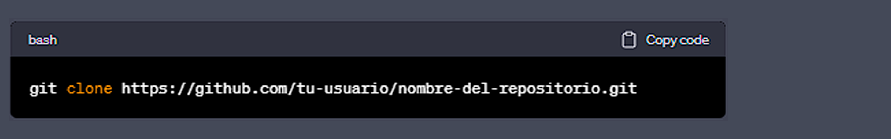

  

# ***Aprendiendo Python con ChatGPT***

Este repositorio contiene una serie de 100 ejercicios de nivel básico para aprender Python, que van desde conceptos simples como variables y operadores, hasta estructuras de control de flujo más complejas, como bucles y condicionales.

El objetivo principal de este repositorio es proporcionar una herramienta educativa para quienes deseen aprender Python de manera autodidacta y con un enfoque de resolución de problemas. Además, para hacer de la experiencia de aprendizaje algo más agradable, el repositorio viene acompañado de la inteligencia artificial ChatGPT, la cual podrá ofrecer consejos, sugerencias y soluciones a los desafíos planteados en los ejercicios.

En la sección de [`conceptos_basicos`](url), encontrarás una breve introducción sobre Python y sus características, así como explicaciones detalladas sobre los conceptos básicos como variables, tipos de datos, operadores, condicionales, bucles, funciones, clases y módulos. En la sección de "Ejemplos y recursos adicionales", encontrarás algunos ejemplos y recursos adicionales que podrían ayudar a los usuarios a profundizar en el lenguaje Python.

Por otro lado, la sección de [`ejercicios`](url) contiene una lista completa de los 100 ejercicios de nivel básico disponibles en el repositorio, que pueden ser utilizados como desafíos para poner en práctica los conceptos aprendidos en la sección anterior.

Si te interesa contribuir a este repositorio, en la sección de "Contribuir" encontrarás instrucciones sobre cómo hacerlo y las pautas que debes seguir.

Recuerda que este repositorio es una herramienta educativa que está destinada a ser utilizada como guía de aprendizaje y no como un sustituto de un curso completo de programación en Python. ¡Disfruta aprendiendo Python con PythonChallenges-LowLevel y ChatGPT!

 

## **Contenido**

- [`conceptos_basicos`](url) :carpeta con archivos de Python que explican los conceptos básicos del lenguaje de programación.
- [`ejercicios`](url) :carpeta con 100 ejercicios de nivel básico para practicar con Python.

 

## **¿Cómo usar este repositorio?**

1. Clona el repositorio en tu ordenador:

  

2. Abre el archivo [`conceptos_basicos`](url) y lee los archivos de Python para familiarizarte con los conceptos básicos del lenguaje.

3. Abre el archivo [`ejercicios`](url) y elige uno de los 100 ejercicios de nivel básico para practicar.

4. Abre el archivo de Python del ejercicio que has elegido y escribe tu solución.

5. Ejecuta el archivo de Python para comprobar si tu solución funciona correctamente.

 

## **Contribuciones**

Si deseas contribuir al repositorio PythonChallenges-LowLevel, **¡Eres más que bienvenido!** A continuación se presentan las pautas que debes seguir:

1. **Forkea el repositorio:** Primero, debes hacer un fork del repositorio en tu propia cuenta de GitHub haciendo clic en el botón "Fork" que se encuentra en la esquina superior derecha de la página.

2. **Crea una rama:** Luego, crea una nueva rama en tu copia del repositorio para realizar los cambios.

3. **Realiza los cambios:** Haz las modificaciones que desees en tu rama de la copia del repositorio.

4. **Envía un pull request:** Una vez que hayas realizado tus cambios, envía un pull request a la rama principal del repositorio PythonChallenges-LowLevel. Asegúrate de describir tus cambios de manera clara y concisa, y de adjuntar capturas de pantalla o ejemplos si corresponde.

5. **Revisa los comentarios y haz los cambios necesarios:** Es posible que los administradores del repositorio te soliciten que realices cambios adicionales o que realices algunos ajustes antes de aceptar tus cambios. Si esto sucede, no te preocupes: simplemente haz los cambios necesarios y vuelve a enviar el pull request.

6. **Espera la aprobación:** Una vez que tus cambios han sido aceptados y fusionados en la rama principal del repositorio, ¡felicidades! Tus contribuciones han sido aceptadas y ahora forman parte del repositorio.

6. **Notas adicionales** 

- *Siéntete libre de abrir un issue si encuentras algún problema o error en el repositorio.*
- *Por favor, asegúrate de seguir las mejores prácticas y directrices de estilo de Python al realizar cambios en el código.*
- *Si tu contribución es significativa, podrás agregar tu nombre y una breve descripción a la sección "Contribuidores" del archivo README.*

 

## **Licencia**

Este repositorio está bajo la Licencia MIT. Consulta el archivo LICENSE para más detalles.