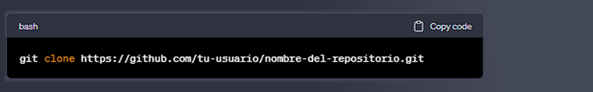

  

# ***Aprendiendo Python con ChatGPT***

Este repositorio es una herramienta para aprender los conceptos básicos de Python y practicar con ejercicios de nivel básico.

#### **Contenido**

- [`conceptos_basicos`](url) :carpeta con archivos de Python que explican los conceptos básicos del lenguaje de programación.
- [`ejercicios`](url) :carpeta con 100 ejercicios de nivel básico para practicar con Python.

#### **¿Cómo usar este repositorio?**

1. Clona el repositorio en tu ordenador:

  

