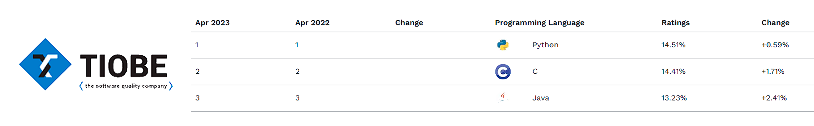

  

# ***GUÍA DE CONCEPTOS BÁSICOS DE PYTHON***

¡Bienvenido! 
Esta guía tiene como objetivo proporcionarte una introducción a los conceptos básicos de Python, uno de los lenguajes de programación más populares y utilizados en la actualidad.

  

---

En esta guía encontrarás información sobre los siguientes conceptos básicos:

### 1. **[`VARIABLES Y TIPOS DE DATOS:`](https://github.com/emilianod98/PythonChallenges-LowLevel/blob/main/conceptos_basicos/01-Variables%26TiposDeDatos.md)** 
Aprenderás a crear variables y almacenar diferentes tipos de datos como números, cadenas de texto y booleanos.

### 2. **[`OPERADORES:`](https://github.com/emilianod98/PythonChallenges-LowLevel/blob/main/conceptos_basicos/02-Operadores.md)** 
Conocerás los diferentes tipos de operadores en Python, como aritméticos, de comparación y lógicos, y cómo usarlos para realizar operaciones.

### 3. **[`ESTRUCTURAS DE CONTROL DE FLUJO:`](https://github.com/emilianod98/PythonChallenges-LowLevel/blob/main/conceptos_basicos/03-EstructurasdeControldeFlujo.md)** 
Aprenderás a usar estructuras de control de flujo como los bucles for y while, y las declaraciones condicionales if, elif y else para controlar el flujo del programa.

### 4. **[`FUNCIONES:`](https://github.com/emilianod98/PythonChallenges-LowLevel/blob/main/conceptos_basicos/01-Variables%26TiposDeDatos.md)** 
Aprenderás a crear y llamar funciones en Python, y cómo usar argumentos y parámetros.

### 5. **[`LISTAS,TUPLAS Y DICCIONARIOS:`](https://github.com/emilianod98/PythonChallenges-LowLevel/blob/main/conceptos_basicos/01-Variables%26TiposDeDatos.md)** 
Conocerás las diferentes estructuras de datos en Python, como listas, tuplas y diccionarios, y cómo usarlas para almacenar y manipular conjuntos de datos.

### 6. **[`ARCHIVOS Y ENTRADA/SALIDA:`](https://github.com/emilianod98/PythonChallenges-LowLevel/blob/main/conceptos_basicos/01-Variables%26TiposDeDatos.md)** 
Aprenderás a leer y escribir archivos en Python, y cómo manejar la entrada y salida de datos en tu programa.

### 7. **[`MÓDULOS Y PAQUETES:`](https://github.com/emilianod98/PythonChallenges-LowLevel/blob/main/conceptos_basicos/01-Variables%26TiposDeDatos.md)** 
Conocerás los conceptos de módulos y paquetes en Python, y cómo importarlos y usarlos en tu programa.

---

Esta guía está diseñada para principiantes en Python y no se asume ningún conocimiento previo de programación. Si ya tienes experiencia en programación, algunos de estos conceptos pueden resultarte familiares, pero te recomendamos revisarlos de todos modos para asegurarte de que tienes una comprensión sólida de los fundamentos de Python.

[`¡EMPECEMOS!`](https://github.com/emilianod98/PythonChallenges-LowLevel/blob/main/conceptos_basicos/01-Variables%26TiposDeDatos.md)

  

